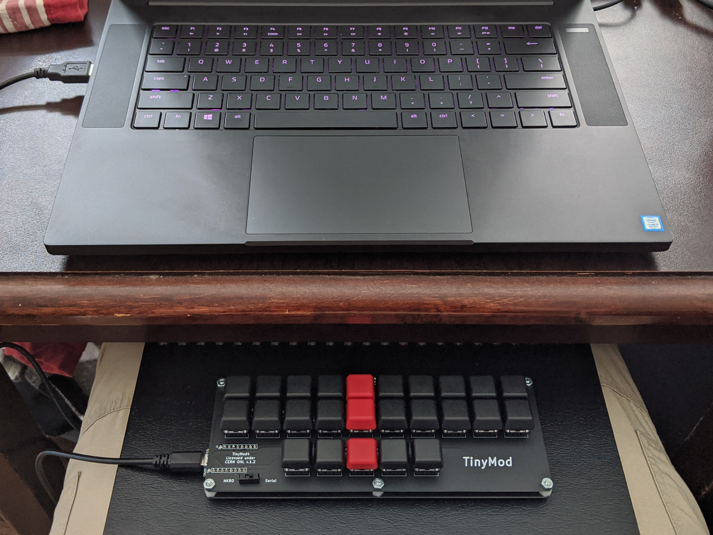

# Plover Custom

A repository to keep my Plover dictionaries synced across devices and provide some information about what I use.

## Powered by
[Plover](http://www.openstenoproject.org/plover/) - Part of the [Open Steno Project](http://www.openstenoproject.org/).

### With additional dictionaries from
- [Typey Type](https://didoesdigital.com/typey-type/) - A free in browser application to help steno students master stenography.
- [Charley Shattuck](https://github.com/CharleyShattuck/Plover-Dictionaries) - A steno enthusiast and creator of Stenomod.

## My gear
#### [TinyMod4](https://stenomod.blogspot.com/2019/09/assembling-tinymod4.html) - Stenomod 
A compact steno writer for enthusiasts. Featuring comfortable keycaps, a small footprint, and an passionate creator who's eager to help out if you run into any issues.

#### [Splitography](https://softhruf.love/collections/writers/products/assembled-erl-black?variant=27367543558) - SOFT/HRUF
> A pay what you will compact keyboard intended for use with Plover, free and open source stenography software. This is a low-cost keyboard with minimal packaging and design, and arrives fully assembled, ready to use.

## My portable setup
In place of a tripod, I typically rest a book or binder across my legs and place the writer there. It's much faster to set up and more comfortable to transport in a backpack.

